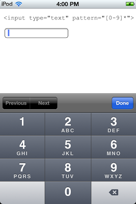

## 手机使用九宫格数字键盘
 
在移动设备上的输入内容从来都是一件很麻烦的事情，所以如何简化用户的输入，让用户更直观、快速、简单的输入内容是很重要的。语音输入、手写输入、摇一摇、咻一咻什么的都是看起来很高大上的东西呀。

但基础的东西还是逃不脱键盘输入。

手机屏幕太小，所以即使是全键盘布局，大多数情况下也都只包含了字母和一点点常用符号。要输入数字，你需要切换一下。

### 如何直接用数字键盘来输入内容

HTML5 规范增加了更多的 input 类型，其中就有 number类型的输入框。只要我们设置 `type="number"` 默认就会弹出数字键盘。这样就可以直接输入数字。


其他类似url、telephone、email、date等类型的特殊内容都有对应的键盘布局帮助我们快速输入。


但还是不够呀！

### 我们都喜欢九宫格

因为我们都有单手操作手机的需要，所以我们需要一个简单的布局，能让我们单手触碰到每一个键盘位置 —— 除非你的手特别大，大到可以大拇指在屏幕各个角落游动。

九宫格数字键盘相比全键盘更简单也更方便。

那我们如何调出九宫格的数字键盘呢？当产品提出这个期望的时候，我的第一个反应是：ios要越狱装其他九宫格布局的输入法才能系统级支持；否则需要做一个模拟数字键盘，还要阻止掉原生键盘的弹出，最后还要兼容性测试，成本不小啊！

ios7虽然已经支持了九宫格布局，但是如果用户没有设置键盘的默认布局为九宫格，那么数字键盘与之前的并无二样。

虽然跟产品确认这个需求的目标是减少用户切换键盘的成本，采用默认键盘就可以满足需求了。
但还是好奇的去查了点资料，主菜在下面：

#### 用tel键盘来替代

ios默认`type=tel`的输入框的键盘是九宫格的。网上有些人说可以考虑用号码键盘来替代：


但他不是纯粹的数字键盘，还包含了`+*#`等符号，而且很别扭不是嘛。。。

#### hack之

通过设置pattern可以限制输入框输入的内容。在ios中，若设置`pattern="\d*"`或`pattern="[0-9]*"`会调出如下键盘：



九宫格数字键盘，但是没有小数点。所以对于主客库存/商品数量输入框，采用这种方式就很完美。

但是对于价格，这个方式就无法满足了。

我尝试在`pattern`中添加小数点，发现只要表达式变成其他的一些格式都会使键盘显示成普通的全键盘，哪怕只是添加了一些无关紧要的东西都会有影响，

```
<input type="text" pattern="[0-9\.]*"/>
<input type="text" pattern="[\d\.]*"/>
<input type="text" pattern="[\d]*"/>
<input type="text" pattern="(\d)*"/>
```
那android下如何？实测发现，在android（4.3）下`pattern`属性不会产生效果，但是设置了`type=number`以后默认使用的就是九宫格数字键盘。


所以使用`<input type="number" pattern="\d*"/>` 在android（4.0+）以及ios下默认都会弹出九宫格的数字键盘。

这个方案在不允许输入小数点的场景中应用是一个很完美的方案。

#### 模拟数字键盘

如果是要输入价格、长宽高等内容，小数点是无法避免了。这个时候怎么做才好呢？

我能想到的就只有模拟数字键盘了。

模拟数字键盘首先要解决的就是如何阻止掉默认的键盘弹出。

网上搜索了一下发现如下几种方案：
1. 设置输入框为只读（readonly），设置禁用输入功能（disabled）。这样就无法弹出键盘了，然后我们通过脚本绑定点击事件弹出模拟的键盘完成输入操作。
2. 使用模拟的输入框，这样就没有阻止原生输入框键盘的问题了。
3. 在获取焦点的同时另输入框失去焦点可以令默认的键盘隐藏。

```
var hideKeyboard = function() {
 document.activeElement.blur();
 $("input").blur();
};
$(input).on('focus', hideKeyboard);
```

网上有评论说第三种方案存在不生效的场景。但我在android4.3和ipad mini上是测试通过的。只是在ipad上明显可以看到键盘上去又下来的动画过程。

第一种方式，如果设置disabled的话，脚本无法捕捉到focus事件。使用readonly在android4.3和ipad mini上通过。可以通过focus和blur来响应模拟键盘的显示和隐藏。

第二种方式可能比较稳妥一些，但是需要自己捕捉键盘显示和隐藏的时机。

目前并没有做广泛的真机测试（没这个条件啊。。。），所以可能有些结论是错误。望请知晓的同学指教，多谢 ：）


