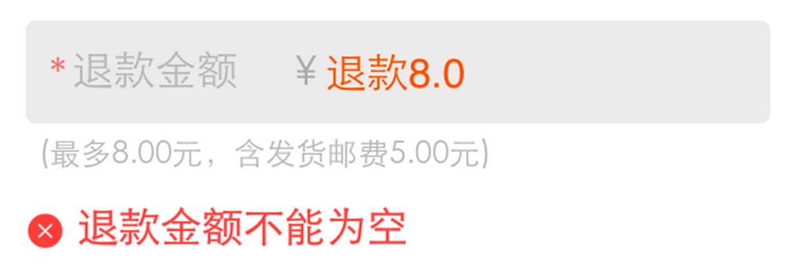

## 关于number_input获取值的问题

HTML5新增了好些类型的表单域，虽然我很少在日常工作中使用，但一直觉得web终究是在向好的方向发展的。各大浏览器厂商都趋向于遵循标准；标准的制定有大量的有经验的开发者参与；以前我们需要用脚本实现的东西，慢慢的都有规范来支持了。赞啊！

但（转折点来了）问题来了：如果标准规定的东西，跟我们实际遇到的需求有些冲突怎么办。。。

这次遇到的问题是这样的：金额输入框需要校验金额上下限，当然还有禁止非数字输入等基本的规则。这有很多现成的方案，比如鼎鼎大名的[auth][]组件，不管是无线端还是PC端都差不多。需求还需要在移动设备中弹出数字键盘。所以我们需要用到type=number的属性。

简单测试一下，通过auth组件配置了必填、上下限，通过表单域类型弹出数字键盘，一切都如想象的美好。

但在测试过程中，我们发现用脚本获取到的值为空字符串——只要输入了非数字内容，获取的值就为空。

*PS：我之前一直以为type=number就意味着不能输入非数字内容来着。。*

郁闷的是，这是[标准的实现](https://html.spec.whatwg.org/multipage/forms.html#number-state-(type=number))：

> The value sanitization algorithm is as follows: If the value of the element is not a valid floating-point number, then set it to the empty string instead.

### 怎么解决？
在这个场景下，我选择的解决方案是这样的：必填校验和数字校验，统一提示文案为——“请输入有效数字。” （简单不折腾。。 ）

### 扩展

扩展一下，其他类型的表单域是怎么计算value值的呢？

简单阅读文档就可以发现，不同的表单域对无效值的处理大抵分为以下几类：

1. date/time、number等，若值不是有效值，则为空字符串。
1. range、color等，若值不是有效值，则为默认值（color为#000000，range的默认值与max、min、step等设置有关）。
1. tel、password等。若值不是有效值，依然直接获取值。

[auth]: http://gallery.kissyui.com/auth/doc/guide/index.html