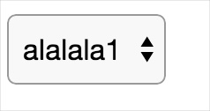
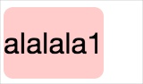
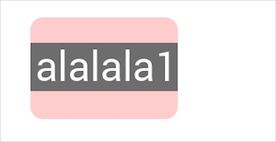
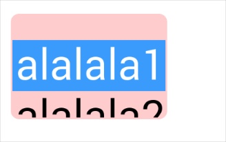
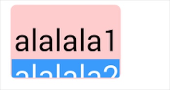

# HTC机型的下拉菜单渲染问题解析

## 问题描述

Select 控件在webkit内核浏览器下，默认右侧是有一个三角箭头来表示这是一个下拉菜单控件，如下图：




在某些场景下，我们需要自定义下拉菜单的展示样式（PC端大多会选择用模拟菜单，但移动端可能会选择保守一些）。

所以去掉三角箭头，自定义显示外观还是比较常见的。这次遇到的就是HTC One Max机型在这个场景下出现的渲染问题。

先给大家看最小demo的代码。

```
<style>
.demo {
    height: 40px;
    font-size: 16px;

    -webkit-appearance: none;
    border: 0;
}
</style>
<select class="demo">
    <option value="1">alalala1</option>
    <option value="2">alalala2</option>
</select>
```

大部分环境下工作良好，但在HTC One Max机型中不但显示效果不同，甚至交互后的结果也有问题。


_正常环境_


_HTC One Max机型中的渲染效果_

并且**在该机型中选择最后一个选项的时候，显示出来却是倒数第二个元素的文案**。显示效果跟第一张截图是一样的。

虽然通过脚本获取到的value值是`2`，但对于操作者来说，显示的选项与实际选择的项不符，这是有问题的。

## 重现步骤

那么原因是什么呢？答案就在上面demo代码中！

如下几种情况能重现这个问题：(`appearance:none;`是必须的)

1. `height:4rem;`, `font-size:1.6rem;`, `border:0;`
2. `height:40px;`, `font-size:16px;`, `border:0;`
3. `height:30px;`, `font-size:12px;`, `border:0;`

根据以上情况我一度以为已经找到规律了（2.5倍的数据关系）。但如果修改为`border:1px solid transparent;`后，第2、3条场景就不会有这个问题了，但第一条还是有问题。

另外随意的修改了几个数字，皆有不同的表现，于是就昏头了。所以规律我是总结不出来了。。。

## 解决方案

如果你也遇到了这个问题，要怎么解决呢？

1. 改border试试，不要设置零边框。
2. 修改`height`或`font-size`试试
3. 要不就不要设置`appearance:none;`了。

## 为啥？

当设置`line-height: 50px;`以后，可以看到如下效果：


_未选择，默认情况_


_选择最后一项以后_

所以确实跟高度有关，当选择了最后一项的时候，选择项被遮盖了，显示的是选择项的前一项。实际上脚本获取的value是正确的。


## By The Way

在HTC OneMax中使用非默认内核的浏览器的时候，这个问题根本不存在。


在ios中因为系统限制无法使用第三方的浏览器内核，但因为ios本身比较一致，在兼容性上不至于那么让人疯狂（如果测试过了就不会有意外）。

但android，因为客户端严重的碎片化，不管投入多少精力做兼容性测试依然无法安心。

考虑到android上可以使用第三方的浏览器内核，**如果主客团队能替换掉webview默认的内核的话就可以让h5 webapp趋向一致，避免掉很多无谓的兼容性开发。**